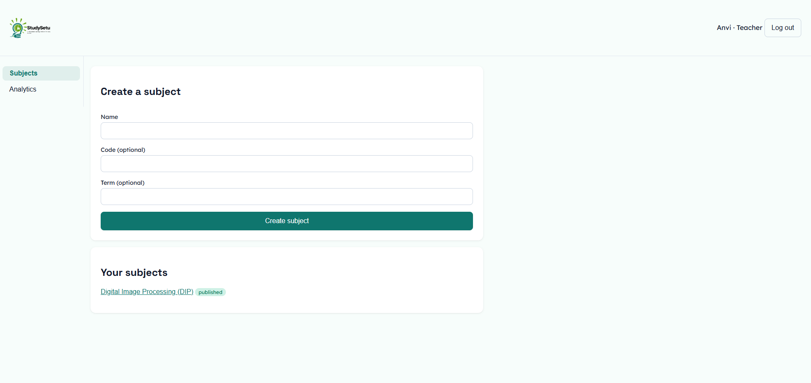
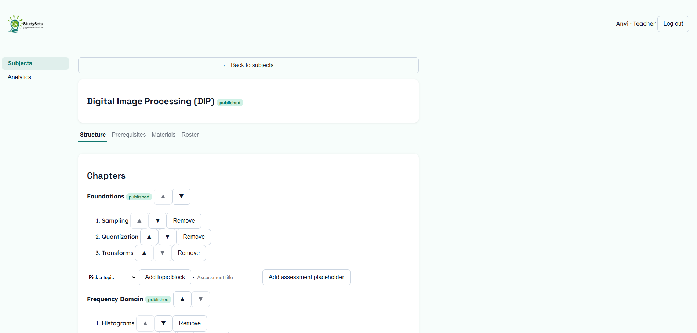
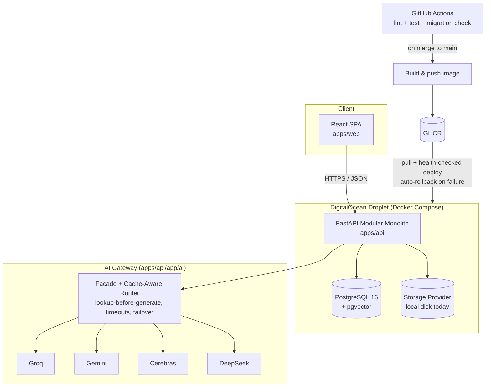

# StudySetu

**A Personalized Learning Platform for Every Student.**

🔗 **Live:** [studysetu.caffeineclause.tech](https://studysetu.caffeineclause.tech)

---

## What it is

The teacher teaches. StudySetu makes sure it stuck — for every single student.

StudySetu is an AI-powered revision and assessment companion, not a teaching replacement. Teachers stay the source of truth: they build the curriculum and their own materials ground everything the system generates. StudySetu's job is what comes after the lecture — figuring out, per student, exactly what didn't land, and building a short, personalized revision session around that specific gap instead of re-teaching the whole chapter to everyone equally. Every AI-generated question and explanation is reviewed by a teacher before a student ever sees it, and the actual diagnosis of what a student knows runs on deterministic, explainable math — never an LLM's opinion.

## Live demo

**URL:** https://studysetu.caffeineclause.tech

The accounts below are purpose-made demo accounts on the platform's demo institution (`gls-demo`) — not real student data. They sit alongside a small amount of real, previously-published course content (one published chapter with an approved question bank) so the diagnostic → personalized session → doubt chat flow can actually be clicked through end to end.

| Role | Login | Password |
|---|---|---|
| Institution admin | `demo-admin@gls-demo.test` | `qVU7KynzK4RH` |
| Teacher | `demo-teacher@gls-demo.test` | `DKRMUXEuUYSg` |
| Student | `DEMO001` | `FF6GcVHgv3rU` |
| Student | `DEMO002` | `SzS8eCzzXjT2` |
| Student | `DEMO003` | `FjPhkcdbydTa` |

Students log in with their roll number (not an email); teacher and admin log in with email. All three roles select institution `gls-demo` at login.

### Product walkthrough

**"StudySetu hai to mumkin hai"** — a short look at a student's diagnostic result turning into a personalized revision session.

▶ **[Watch it live](https://studysetu.caffeineclause.tech/#top)** — the video plays (muted, looping) in the landing page hero. GitHub doesn't render autoplaying video well inside a README, so this links to the live site instead of embedding the file.

<!-- Once apps/web/public/media/hero-video.mp4 is committed and deployed, the raw file is also
     reachable directly and can be linked or embedded here, e.g.:
     [Download the raw video](https://studysetu.caffeineclause.tech/media/hero-video.mp4) -->

### Screenshots

Screenshot files live in [`docs/screenshots/`](docs/screenshots/). Add the following filenames there to populate this section:

| Screen | File |
|---|---|
| Landing page hero | `docs/screenshots/landing-page-hero.png` |
| Teacher dashboard | `docs/screenshots/teacher-dashboard.png` |
| Teacher curriculum builder | `docs/screenshots/teacher-curriculum-builder.png` |
| Student diagnostic | `docs/screenshots/student-diagnostic.png` |
| Student lesson | `docs/screenshots/student-lesson.png` |
| Student doubt chat | `docs/screenshots/student-doubt-chat.png` |
| Admin analytics | `docs/screenshots/admin-analytics.png` |

<!--





-->

## Features

**Adaptive diagnostics.** Opening a topic for the first time triggers a five-question diagnostic probe, stratified across difficulty (1 easy, 2 medium, 1 hard) and drawn from a teacher-reviewed, misconception-tagged item bank — plus a fifth slot pulled from a prerequisite topic whenever a student's history shows they're already shaky there. Feedback during the probe is a neutral acknowledgment only; the full review (every question, the reasoning, what it revealed) shows immediately after question five, so the diagnosis itself isn't contaminated by mid-probe teaching.

**Personalized learning sessions with prerequisite-aware revision.** Each session is assembled from what the diagnostic actually found: a short bridge card naming the gap, a revision segment for any weak prerequisite topic (injected automatically, with its own retrieval questions), the core explanation and a worked example, practice questions with instant reasoning, a contrast card addressing the specific misconception the student's own wrong answer revealed, and a closing summary and cheat sheet.

**BKT-based mastery tracking.** Every answer — diagnostic, practice, or assessment — updates a per-student, per-topic mastery score using Bayesian Knowledge Tracing: explainable, cheap, and incremental, never an LLM guess. Mastery confidence decays with inactivity, so a topic a student hasn't touched in weeks quietly resurfaces for revision on its own.

**Teacher analytics and misconception clustering.** Three altitudes: a *Today* view surfacing who's stuck and why plus misconception clusters crossing a configurable threshold; an *Explorer* drill-down from class to subject to chapter to topic to individual student; and an event-sourced *Timeline* — the same underlying ledger rendered for both teacher and student — showing every diagnostic, session, and mastery shift in true causal order.

**Topic-scoped AI doubt chat.** A student reading a lesson can ask a follow-up question in context, without specifying subject, chapter, or topic — the answer is grounded in the exact lesson content they're already looking at, generated through the same provider-agnostic AI gateway as everything else, and declines gracefully if the question is genuinely off-topic.

**Multi-provider AI failover.** Every AI call — item bank generation, session content, doubt answers — goes through one gateway with a configurable provider chain (currently Groq, Gemini, Cerebras, and DeepSeek), per-provider timeouts, one same-provider retry on a malformed response, and automatic failover down the chain on any provider failure. Nothing about which provider serves a given feature is hardcoded; it's a config value.

**Institution and pool-based enrollment.** Institutions provision accounts top-down (CSV roster import, not open self-signup) and group students into pools — a section, a batch, a cohort. Attaching a pool to a subject snapshots its current membership rather than live-linking it, so a later pool edit never silently changes who's enrolled in a subject already in progress; a non-destructive banner offers to pull in new pool members instead.

**Generated-once, served-forever content.** Every AI output is written to a permanent store before it's ever shown, and every generation request checks that store first — so a question bank or lesson segment is generated exactly once per topic (or per topic+level+misconception, for session building blocks) and reused for every student after that. Every generation is logged with provider, model, tokens, and cache-hit status, giving a real cost ledger, not an estimate.

**Teacher review and visibility.** No AI-generated item reaches a student until a teacher approves it — one click for approve-all, or item-by-item for the careful. Every AI artifact a student encounters is visible to their teacher on the same timeline, with a one-click flag for anything that needs a second look.

## Technical architecture

- **Frontend:** React 18 + TypeScript, built with Vite. Role-based shells for student, teacher, and admin. Runtime branding and feature flags load from a single `/config.json` response and resolve to CSS custom properties — no hardcoded colors, fonts, or copy for anything config-driven.
- **Backend:** FastAPI, structured as a modular monolith — one deployable service, but each product area (auth, curriculum, learning, mastery, analytics, doubts, ...) owns its own router, models, and queries with no cross-module reach-around.
- **Database:** PostgreSQL 16 with the `pgvector` extension, one instance, schema-migrated forward-only. `pgvector` backs the platform's semantic-search infrastructure for topic matching and the open-ended "Explore" mode.
- **AI gateway:** a single facade (`ai.generate(...)`) sits in front of a provider-agnostic gateway. Provider SDKs/HTTP clients are isolated to one adapter module per provider — nothing else in the codebase talks to a provider directly. The gateway owns lookup-before-generate caching, per-provider timeouts, a same-provider parse retry, and chain failover across four independently onboarded providers (Groq, Gemini, Cerebras, DeepSeek).
- **Storage:** file uploads (course materials, submissions) go through a storage abstraction — local disk today, swappable for object storage via config with no application code change.
- **Infrastructure:** Docker Compose on a single DigitalOcean droplet. A separate shared edge layer handles TLS termination and reverse proxying for this and other projects on the same droplet.
- **CI/CD:** GitHub Actions. Every push runs linting, the backend and frontend test suites, and a migration check in parallel; merges to `main` build and push a versioned image to GitHub Container Registry, then deploy to the droplet with a health-checked rollout that automatically rolls back to the previous image if the new one fails its health check.



## Getting started (local development)

Requirements: Docker, [`uv`](https://docs.astral.sh/uv/) (Python package/venv manager), [`pnpm`](https://pnpm.io/), Node 20+, Python 3.12+.

```bash
# 1. Configure
cp .env.example .env   # fill in DATABASE_URL, JWT_SECRET, and at least one AI provider key

# 2. Start Postgres
docker compose -f infra/docker-compose.dev.yml up -d

# 3. Migrate the schema and seed demo data
bash scripts/migrate.sh
set -a && source .env && set +a
APP_CONFIG_DIR=config uv run --project apps/api python scripts/seed_demo.py

# 4. Run the API (terminal A)
cd apps/api
set -a && source ../../.env && set +a
APP_CONFIG_DIR=../../config APP_PROMPTS_DIR=../../prompts uv run uvicorn app.main:app --reload

# 5. Run the web app (terminal B)
cd apps/web
pnpm install
pnpm dev
```

Open `http://localhost:5173` (proxies `/api` and `/config.json` to the API on port 8000). The seed script prints the demo institution's login details to the console when it runs.

**Running the tests:**

```bash
cd apps/api && uv run pytest                       # backend
cd apps/web && pnpm typecheck && pnpm build         # frontend build + type check
cd e2e && npx playwright test                       # end-to-end (requires both servers running)
```

**Resetting the local database:**

```bash
docker compose -f infra/docker-compose.dev.yml down -v && docker compose -f infra/docker-compose.dev.yml up -d
bash scripts/migrate.sh
uv run --project apps/api python scripts/seed_demo.py
```

## Engineering practices

A few decisions we hold ourselves to, deliberately:

- **Config-driven, not hardcoded.** Every subsystem's tunable values — AI provider chains and timeouts, diagnostic probe composition, mastery decay rates, branding and design tokens — live in versioned YAML under `config/`, read from exactly two places in the codebase (one for the backend, one for the frontend). Changing a provider's priority, a color palette, or a quota is a config change, not a code change.
- **Provider isolation.** Every AI provider's SDK or HTTP client is confined to its own adapter module. Feature code never imports a provider directly — it calls one facade function, so swapping, adding, or removing a provider touches one file, not every call site.
- **Automated testing on every change.** New backend behavior ships with real tests against a real Postgres instance, not just mocks of the ORM — including tests that build two genuinely different scenarios and assert the system produces different, correctly-scoped output for each, not just "returns something."
- **CI/CD with automatic rollback.** Every merge to `main` is built, pushed, and deployed through a pipeline that health-checks the new deployment before committing to it, and automatically reverts to the last known-good image if the health check fails — a bad deploy self-heals without a human needing to notice first.
- **Event-sourced by default.** Nothing about a student's or teacher's activity is silently overwritten. Every user-visible action appends an event to a permanent ledger; the "timeline" both roles see is that ledger, rendered — not a separate feature bolted on afterward.

## License

No open-source license has been published for this repository yet — all rights reserved by default until one is added.
