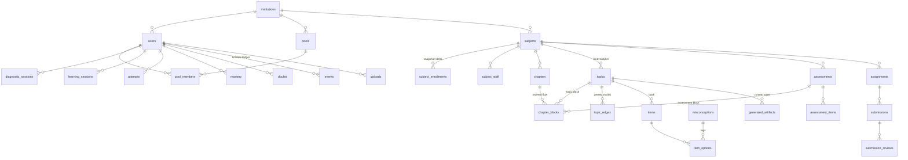

# DATABASE.md - StudySetu Canonical Schema (FINAL, validated)
Source of truth for the database. Implemented exactly by db/migrations/0001-0006, which were applied against a live PostgreSQL 16 + pgvector instance with zero errors (32 tables) and constraint-tested (scope checks, block exclusivity, one-correct-option, event idempotency key). Schema changes: edit here -> new forward-only migration -> MEMORY.md entry. Never edit an applied migration.

## 1. ER Diagram

## 2. Entity groups and why each table exists
- **Identity (0002):** institutions (tenant root; `is_personal` = self-serve teacher tier), users (role-discriminated; institution-provisioned; roll_number OR email; activation flow via activation_code_hash), pools + pool_members (institution-level cohorts).
- **Curriculum (0003):** subjects, subject_staff (co-teaching future-proof), subject_enrollments (SNAPSHOT+DELTA: pool edits never propagate; source_pool_id remembers origin; archive-not-delete), chapters, **topics** (the atomic unit; `kind='explore'` rows with NULL subject form the global Explore library so ALL machinery: items, mastery, sessions, artifacts: works unchanged for Explore), chapter_blocks (the ordered Topic/Assessment flow; CHECK enforces exactly one ref), topic_edges (prereqs; origin = implicit/teacher/ai_suggested), materials (polymorphic attachments; readability marks scanned docs as stored_only until Phase 2 OCR).
- **Assessment + learning (0004):** misconceptions registry, items (origin ai/teacher, review_status gate: only `approved` items reach students), item_options (partial unique = exactly one correct), assessments (gating + feedback modes per S2/S3), assessment_topics/items, diagnostic_sessions (the 5-question probe: item_ids array records exactly which bank items were drawn), learning_sessions (plan jsonb = ordered refs into generated_artifacts: personal composition of shared segments), attempts (context enum spans diagnostic/practice/assessment/revision/explore), mastery (+confidence decay column for S4), mastery_history.
- **Work + doubts (0005):** assignments (rubric jsonb, grading_mode: ai modes dormant until Phase 2), submissions, submission_reviews (ai_suggested payload slot + human scores = the override trail), doubts (typed raw_text in Phase 1; OCR fills it in Phase 2).
- **Ledger + AI (0006):** uploads (permanent for materials/submissions, TTL for doubt photos: expires_at nullable), **events** (THE timeline: append-only; client_id/seq nullable columns are the pre-built Phase 2 offline-sync idempotency key: partial unique index already in place), **generated_artifacts** (the Generated Content Store: scope x type x cache_key unique: lookup-before-generate lives here; flagged/hidden = teacher QA), ai_invocations (cost/latency/cache-hit ledger), demo_cache.

## 3-8. Keys, indexes, constraints, UUIDs, naming, soft delete, audit
Unchanged principles from the validated v1 design, re-applied: UUID PKs everywhere (`gen_random_uuid()`); offline clients will mint IDs in Phase 2; snake_case/plural/`*_at`/`is_*` conventions; enums for closed sets; FKs RESTRICT except owned children (CASCADE on options, blocks, enrollments, submissions); soft delete (`deleted_at`) ONLY on catalog entities (users, subjects, chapters, topics, items, materials, assessments, assignments): never on ledgers (attempts, events, mastery_history, ai_invocations); `created_at/updated_at` + one shared trigger everywhere; partial indexes on `deleted_at IS NULL` hot paths; HNSW on topics.embedding (768: MUST match the chosen embedding model: config `ai.embedding_dim`); trgm on topic titles; DEFERRABLE unique positions on chapters/blocks (enables atomic reorder).

## 9. Migration strategy | 10. Volumes | 11. Backups
Forward-only numbered SQL + `schema_migrations` ledger via scripts/migrate.sh (transaction per file, idempotent skip). Expand-then-contract for changes. Volumes: `pg_data` (db), `uploads_data` (/data/uploads), `backups_data` (/backups), `caddy_data` (TLS). Backups: nightly `pg_dump -Fc | gzip` into backups_data (keep 7) -> weekly scp to a teammate laptop -> weekly restore-drill into Neon -> DO droplet snapshots outermost. Materials/submissions uploads ARE backed up (weekly tar of uploads_data alongside the dump: unlike v1's disposable photos, submissions are permanent records).

## 12. LOCAL database operations (the daily answers)
- **Run:** `docker compose -f infra/docker-compose.dev.yml up -d` starts pgvector:pg16, port 5432 -> localhost, volume `pg_data_dev` (inspect: `docker volume inspect studysetu_pg_data_dev`).
- **Migrate:** `bash scripts/migrate.sh` (defaults to the dev compose DB; honors DATABASE_URL when set).
- **Reset:** `docker compose -f infra/docker-compose.dev.yml down -v && docker compose -f infra/docker-compose.dev.yml up -d && bash scripts/migrate.sh && uv run scripts/seed_demo.py` (down -v deletes the volume = true zero).
- **Seed:** `uv run scripts/seed_demo.py` (idempotent; creates GLS-demo institution, teacher Anvi, pool CSE-3A, subject DIP, sample chapter/topics/bank, students incl. Yash).
- **Backup/restore locally:** `docker compose -f infra/docker-compose.dev.yml exec postgres pg_dump -U app -Fc appdb > local.dump` / `pg_restore -U app -d appdb --clean local.dump` (via exec).

## 13. PRODUCTION database operations
- **Run:** same image, in infra/docker-compose.yml on the droplet; volume `pg_data` lives under /var/lib/docker/volumes/ on the droplet's SSD; NO ports exposed (compose-network only: verify_server.sh checks this).
- **Migrations reach prod:** deploy.yml -> infra/deploy.sh runs migrate.sh inside the api container against the prod DATABASE_URL AFTER `compose up`: since migrations are expand-then-contract, old containers tolerate new schema during the swap.
- **Local/prod sync:** one-way, schema-only, via git: the same numbered files apply everywhere; the ledger table guarantees each applies once. DATA never syncs down or up (restore-drills into Neon are the only data movement).
- **Deployments and data:** deploys replace the api container only; pg_data volume is untouched by deploys. **Rollback:** redeploy previous image tag; the database does NOT roll back: it only ever moves forward compatibly (this is why expand-then-contract is a RULES.md law).

## 14. Future scalability (worked, on THIS schema)
Syllabus-PDF import (Phase 2) = writer into existing chapters/topics/blocks. OCR = fills doubts.raw_text + materials.extracted_text + flips readability. Offline sync = events.client_id/seq (index already built). AI pre-grading = submission_reviews.ai_suggested (column already built). Adaptive diagnostics = selection-policy change; diagnostic_sessions unchanged. Co-teachers = subject_staff (built). Parent accounts = new role enum value + guardian_links table (additive). Partitioning candidates at scale: attempts, events (append-only monthly: the easy case).

## APPENDIX - Visual sample-row walkthrough
(Yash at GLS, Digital Image Processing)
| topics | kind | subject_id | title |
|---|---|---|---|
| t-tran | subject | s-dip | Transforms |
| t-freq | subject | s-dip | Frequency Filtering |
| t-vec | explore | null | What are vectors? |

| topic_edges: src | dst | origin | -> "Frequency Filtering requires Transforms" |
|---|---|---|---|
| t-tran | t-freq | teacher | |

| chapter_blocks: chapter | pos | type | ref |
|---|---|---|---|
| ch-2 | 1 | topic | t-tran |
| ch-2 | 2 | topic | t-freq |
| ch-2 | 3 | assessment | a-unit2 |

| mastery: user | topic | p_known | confidence |
|---|---|---|---|
| u-yash | t-tran | 0.41 | 0.8 |

| generated_artifacts: scope | type | topic | cache_key |
|---|---|---|---|
| topic_shared | item_bank | t-tran | h(bank,t-tran,src9f2,v1) |
| segment_shared | segment | t-tran | h(seg,t-tran,struggling,v1) |
| student_unique | doubt_reply | t-tran | h(doubt,d-7) |

| events: user | event_type | topic | payload |
|---|---|---|---|
| u-yash | diagnostic_completed | t-freq | {"score":2} |
| u-yash | revision_injected | t-tran | {"reason":"prereq"} |
| u-yash | mastery_changed | t-tran | {"from":0.41,"to":0.66} |
The timeline screen is literally `SELECT * FROM events WHERE user_id=? ORDER BY occurred_at`: rendered.
